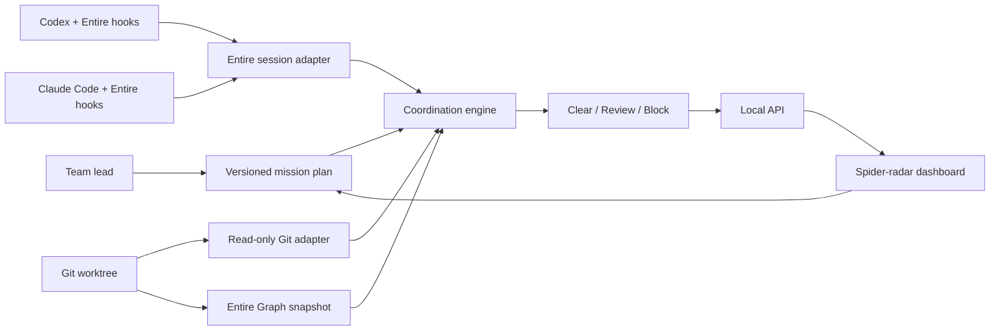

# Spidey Sense architecture

## Architecture objective

Build one verifiable coordination loop around Entire instead of a general agent-management platform:

> plan work -> observe sessions -> resolve code targets -> detect structural collision -> explain evidence -> recommend and verify an action

The design must accept any number of team members, sessions, missions, files, and symbols. Demo fixtures may provide examples, but product behavior must never depend on fixed names or paths.

## System context

## Deployment boundary

The existing `entire-graph` provider remains deterministic and no-egress. Spidey Sense is an additive local application in the same required fork; it consumes provider internals or versioned Graph output without changing existing commands or contracts.

The first implementation should keep `cmd/` entry points thin and place logic under `internal/`, following the repository's conventions. Networked GitHub behavior is not part of the first stable slice. If added later, it must be an explicit, isolated adapter disabled by default and must not alter the Graph provider's behavior.

## Components

### 1. Mission plan and activity store

A versioned document represents the team's declared intent:

- team identifier and display name;
- dynamic members and their public provider/session identities;
- missions with title, intent, owner, status, and target selectors;
- timestamps and optimistic revision/version information.

Targets can be repository-relative files or symbol references. Stored statuses use stable engineering values such as `queued`, `active`, `blocked`, and `complete`; themed labels are presentation aliases.

The store must validate paths, reject traversal, normalize deterministically, and write atomically. Live/private state is ignored by Git; deliberate demo fixtures are clearly labeled synthetic.

### 2. Entire session adapter

The first adapter uses documented Entire JSON commands rather than reading internal metadata files. It normalizes public fields such as session ID, agent, model, status, worktree, activity time, last prompt summary, and touched files when available.

The adapter does not infer a human identity from an agent name. Team membership explicitly maps a person or runner persona to one or more public session IDs.

Provider failures are isolated and returned as health information. They do not erase the last valid plan or Graph analysis.

### 3. Entire Graph adapter

Build or load a full-profile `sem.ProviderSnapshot` containing:

- file and symbol records;
- resolved relations and evidence;
- relation confidence and resolution;
- warnings, completeness, and partial failures.

The adapter creates lookup indexes but does not mutate provider records. Consumers tolerate additive `1.x` fields and preserve stable symbol IDs.

### 4. Coordination engine

The engine is deterministic and independently testable. For every pair of relevant active missions it evaluates:

1. exact same-file or same-symbol overlap;
2. direct relationships between targets;
3. bounded two-hop relationships;
4. test and review targets reachable from the affected area;
5. Graph completeness and evidence quality.

Initial decision semantics:

- **BLOCK:** exact target overlap or a direct dependency where concurrent edits should be sequenced.
- **REVIEW:** a two-hop, type, data-flow, test, co-change, or lower-confidence relationship that needs coordination.
- **CLEAR:** no connection found in the bounded analyzed graph.

These are coordination decisions, not compiler guarantees. Each result includes the target pair, ordered path, relation types, evidence locations, confidence/resolution, recommendation, and completeness caveat.

Each path step and decision also carries an evidence class:

- **confirmed:** exact, package-bound, or import-bound structural evidence with no truncation warning;
- **heuristic:** name-, pattern-, inferred-, framework-, test-, or co-change evidence;
- **incomplete:** evidence with dropped/truncated support, or any Graph result produced from a degraded/partial snapshot.

Only confirmed direct structural evidence can produce a relationship-based `BLOCK`. Heuristic or incomplete paths produce `REVIEW` and an explicit source/test verification requirement. A bounded absence is always labeled incomplete: `CLEAR` never means the runtime programs are independent.

Recommendations are rule-based and verifiable:

- sequence the upstream/dependency mission first;
- rebase or refresh after the blocking mission completes;
- review named callers/type consumers;
- run or inspect Graph-linked/conventional tests;
- ask for manual review when evidence is incomplete.
- inspect source/runtime registration and run focused tests when dynamic dispatch, reflection, generated code, or partial failures limit static resolution.

### 5. Read-only Git adapter

The initial Git adapter observes branch, HEAD, worktree status, worktrees, recent commits, and changed files. It never merges, rebases, resets, or resolves conflicts automatically.

Git evidence supplements the declared plan and session data. It does not replace Graph relationships.

### 6. Local API

The loopback service exposes a small, versioned surface:

- health and capability information;
- aggregate dashboard snapshot;
- validated mission-plan mutations;
- explicit refresh/reanalysis.

Writes are bounded JSON requests. No endpoint accepts arbitrary commands. Errors are structured, and one unavailable provider cannot take down the aggregate response.

### 7. Dashboard

The dashboard prioritizes the decision workflow:

- team lobby and dynamic runner identities;
- plan board and mission stages;
- active session radar;
- Web Zones for repository areas;
- Web Nodes for files/symbols;
- Strands for real Graph relations;
- red Tangles for explainable risks;
- a textual evidence drawer and recommended action;
- Git timeline and provider health.

The visual theme is an original spider-inspired radar, not licensed Spider-Man media. Runner archetypes use original names, colors, and shapes. All decisions, evidence, and controls remain usable without WebGL and with reduced motion.

## Data flow

1. Load and validate the mission plan.
2. Query the current Entire session snapshot.
3. Read observable Git state.
4. build/load the Entire Graph worktree snapshot.
5. Resolve declared and observed targets to stable file/symbol endpoints.
6. Evaluate active mission pairs and rank actionable decisions.
7. Return one immutable dashboard snapshot.
8. Render visual and textual evidence from the same response.
9. Apply an explicit plan mutation and repeat the analysis.

## Contract isolation

Spidey Sense output uses its own experimental schema namespace/version. It must not add required fields to Entire Graph `1.x`, reinterpret relation types, or change the identity algorithm. Unknown additive Graph fields are ignored; unknown Graph major versions fail clearly.

Any Graph warning or partial failure relevant to a mission is carried into the decision. `CLEAR` results include analyzed depth and completeness so absence of evidence is never presented as proof.

## Curveball seams

The design isolates likely surprise requirements:

- **new agent/provider:** add a session adapter;
- **new risk rule:** add a policy over normalized endpoints and relations;
- **offline requirement:** load a recorded Graph/session fixture through the same interfaces;
- **new output or accessibility rule:** add a renderer over the immutable snapshot;
- **checkpoint-intent requirement:** add an intent/drift adapter using checkpoint metadata and semantic diff;
- **scale limit:** switch from accumulating snapshots to streaming/indexed projections;
- **security constraint:** disable mutation/action adapters while retaining read-only analysis.

## Verification strategy

- Unit-test validation, normalization, target resolution, path traversal, decision direction, deduplication, and deterministic ordering.
- Use small temporary Git repositories for integration tests.
- Verify Graph-derived demonstrations against focused source reads and tests.
- Run `entire graph impact` before changing high-risk existing symbols.
- Keep a fixture-driven demo so live session availability cannot block judging.
- Run the repository test/build/check surface before stable checkpoints.
- Run final semantic diff analysis and document warnings or gaps.
